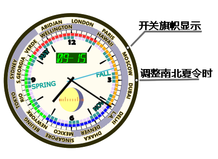

[English](README.md)| [中文](README_zh.md)

# 12时-世界时钟

## 简介
*世界时钟* 包括几个[Rainmeter](https://docs.rainmeter.net/) 皮肤.

外观像普通的圆形时钟一样，不过在边上加了一圈指针，可以显示不同城市和地区所处的时间。

皮肤大小 (px)：200 x 200 / 300 x 300 / 400 x 400 / 500 x 500

## 国旗
皮肤默认设置为有旗帜的版本。

公共场所使用旗帜图案时请务必注意各国家和地区的“旗帜政策”。比如“某些旗帜不适合在一些地区显示”，或者“公开场所不应将旗帜向某方侧放或倒悬”，以及“多旗帜出现时应注意排布，大小”等等问题————由于皮肤设计限制，某些问题可能无法避免。

如果希望避免政治法律风险，可以选用*无旗帜*的版本。

*更新*：
点击表的边界右侧两点钟方向的小白圆形按钮，可以切换国旗显示与否。

以下是旧版操作，不再推荐这样修改。
***
"无旗帜"版本设置

可以用文本编辑软件手动修改对应的ini文件：
- 对皮肤单击右键————选“编辑皮肤”
- 找到模块\[MeterHoursUTC0\]
- 找到属性语句"ImageName=hand12wf.png". 
    可以点'ctrl+F'，搜索"ImageName=hand12wf.png"来找到对应语句
- 把这行改为"ImageName=hand12w.png"
- 刷新皮肤

也可以通过修改文件名来设置，找到皮肤文件夹，“hand12w.png”改为“hand12wf.png”。
***

旗帜文件来自 [github hampusborgos的旗帜库](https://github.com/hampusborgos/country-flags) .

## 城市列表和*夏令时*
有一部分国家和地区采取夏令时制。

调整夏令时: 点击表盘右侧边缘的按钮(三点钟方向的小白圆圈).

   北半球有夏令时政策的地区一般三月底开始实施，十月初结束
   
   南半球有夏令时（北半球的冬天）政策的地区，十月初开始，四月初结束

> [夏令时|夏时制](https://zh.wikipedia.org/wiki/%E5%A4%8F%E6%97%B6%E5%88%B6)
> [各地夏令时间列表](https://zh.wikipedia.org/wiki/%E5%90%84%E5%9C%B0%E5%A4%8F%E4%BB%A4%E6%99%82%E9%96%93%E5%88%97%E8%A1%A8)
> 来自维基百科
>
> [夏令时_百度百科](https://baike.baidu.com/item/%E5%A4%8F%E4%BB%A4%E6%97%B6)

|UTC|夏令时 北|夏令时 南|UTC|夏令时 北|夏令时 南|
|---|---|---|---|---|---|
|UTC+0|ABIDJAN 阿比让|LONDON 伦敦|UTC+12|WELLINGTON 惠灵顿||
|UTC+1|LONDON 伦敦|PARIS 巴黎|UTC-11||WELLINGTON 惠灵顿|
|UTC+2|PARIS 巴黎|CAIRO 开罗|UTC-10|HAWAII 夏威夷|HAWAII 夏威夷 |
|UTC+3|MOSCOW 莫斯科|MOSCOW 莫斯科|UTC-9|||
|UTC+4|DUBAI 迪拜|DUBAI 迪拜|UTC-8||LOS ANGELES 洛杉矶|
|UTC+5|DELHI 德里|DELHI 德里|UTC-7|LOS ANGELES 洛杉矶|DENVER 丹佛|
|UTC+6|DHAKA 达卡|DHAKA 达卡|UTC-6|DENVER 丹佛|MEXICO CITY 墨西哥城|
|UTC+7|SINGAPORE 新加坡|SINGAPORE 新加坡|UTC-5|MEXICO CITY 墨西哥城|NEWYORK 纽约|
|UTC+8|BEIJING 北京|BEIJING 北京|UTC-4|NEWYORK 纽约|MANAUS 马瑙斯|
|UTC+9|TOKYO 东京|TOKYO 东京|UTC-3|RIO DE JANEIRO 里约热内卢|RIO DE JANEIRO 里约热内卢|
|UTC+10|SYDNEY 悉尼||UTC-2|SOUTH GEORGIA 南乔治亚|SOUTH GEORGIA 南乔治亚|
|UTC+11||SYDNEY悉尼|UTC-1|CABO VERDE 佛得角|CABO VERDE 佛得角|

## 昼夜表示
世界表上深色的区域表示夜晚(18:00-6:00)，浅色表示白天(6:00-18:00)

# 其他功能

## 月相

一个比较简单的月相实现
- 29.53059 天作为一个月球周期
- 假设月亮匀速绕地球转动，轨道为正圆

 

## 年表针

青色的表针是年表针，转一圈为一太阳年
- 一个太阳年设置为 365.2422 天
- 可以通过年指针读取关于月份、节气和季节的信息

	季节对应四个颜色
	
		春季:绿色
		
		夏季:红色
		
		秋季:橙色
		
		冬季:蓝色
		
- 6点钟方向为一年开始（1月1日）

# 环境需求和安装方法

## 安装Rainmeter
> [Rainmeter](https://docs.rainmeter.net/) 只能在windows7或以上的系统运行。
> 安装方法请参照Rainmeter手册
> [官方下载链接(4.5.13)](https://github.com/rainmeter/rainmeter/releases/download/v4.5.13.3632/Rainmeter-4.5.13.exe)
> [Installing Rainmeter](https://docs.rainmeter.net/manual/installing-rainmeter/)

## 安装皮肤
> [Installing Skins](https://docs.rainmeter.net/manual/installing-skins/)

## 字体
进入assets文件夹，双击字体文件led16sgmnt2-Italic-1.ttf并点选安装，之后重启Rainmeter。

# 帮助我们

## DIY与许可
程序和外观制作命名时尽量保证易读性，另外也可参照Component文件嘉中的部件来解析、重用和创作。

图像素材由asset中的svg矢量图文件生成，可以用svg编辑器比如[inkscape](https://inkscape.org/)来修改和制作。

本项目采用GPLv2许可协议（开源）。

## 更新
 1.0.6 更新于 2022-08-17
 
 1.0.8 更新于 2022-09-15
 
   √ 为一些地区添加*夏令时*

## 错误和需求
如果发现错误或者有需求，可以发送e-mail到ztbxxt@hotmail.com，或者在Github添加一个Issue。

## 捐助
如果您喜欢我的作品， 

您的捐赠将是对其最大的认可： 

